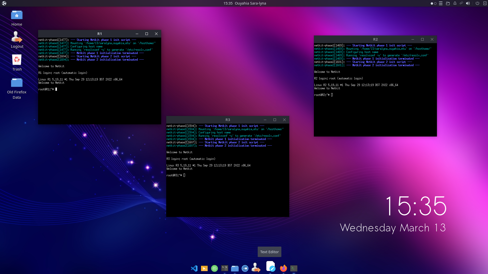
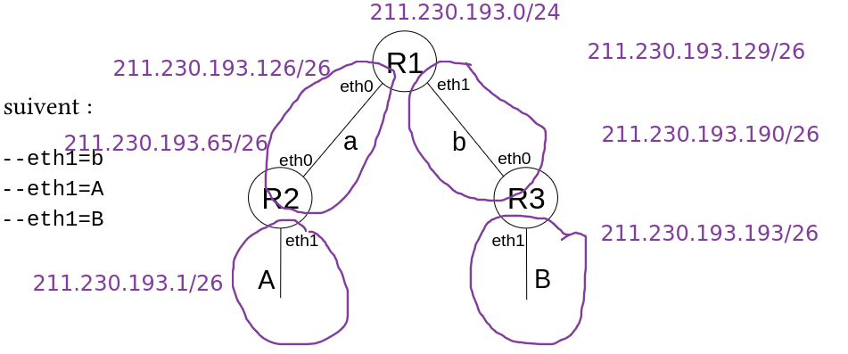
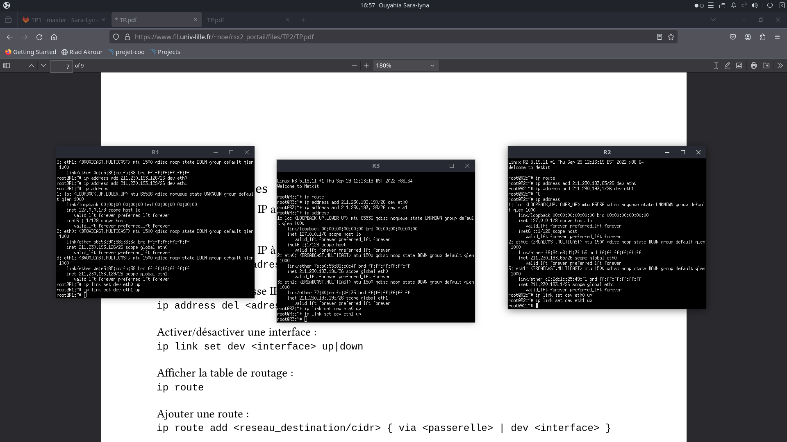
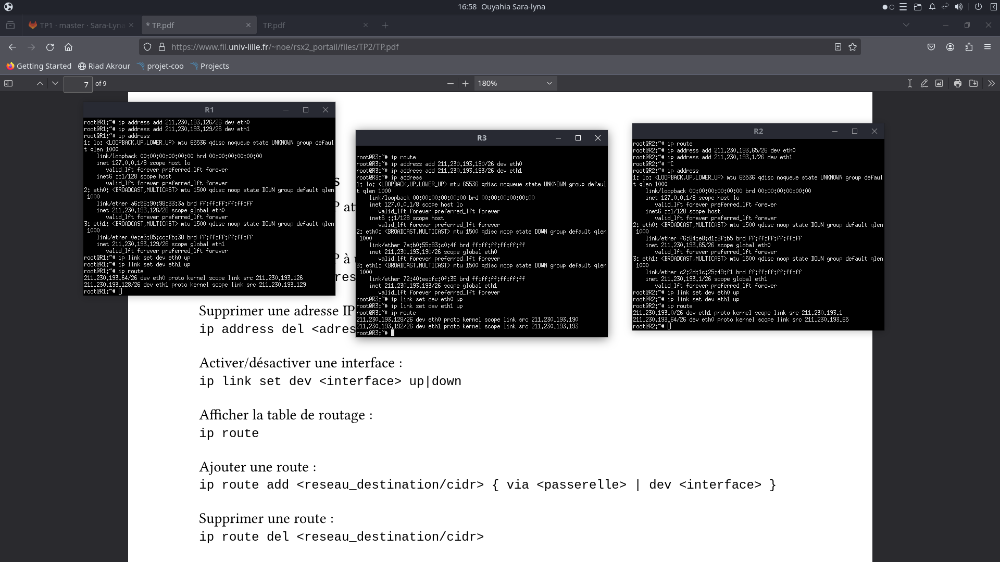
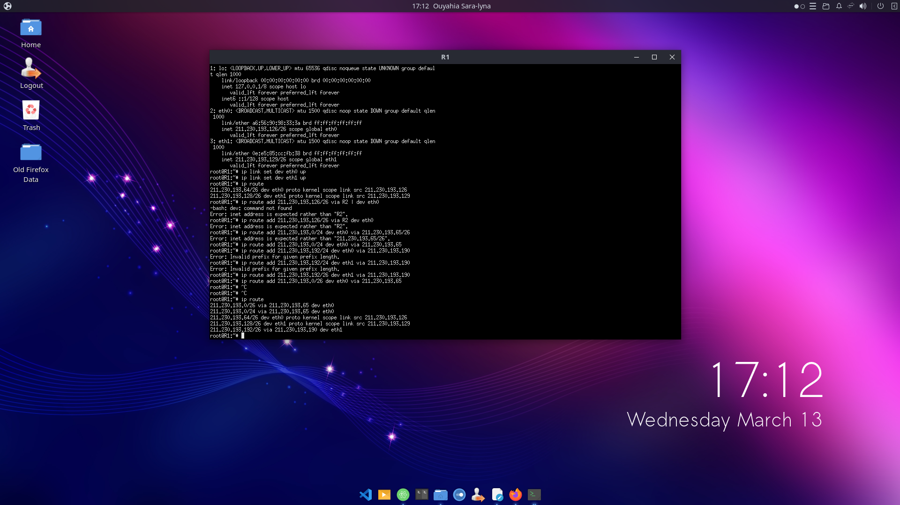

# Rapport pour le TP2

## Semaine 1 : 

### Routage statique 

Mercredi 13 Mars :
- Configuration de trois routeurs :
  - `vstart -D R1 --eth0=a --eth1=b`
  - `vstart -D R2 --eth0=a --eth1=A`
  - `vstart -D R3 --eth0=b --eth1=B`

  
- 1) Quand on lance `ip route` pour afficher la table de routage des routeurs,
la table de routage est vide pour chacun des trois routeurs.

- 2) Configuration et activation des interfcaes des routeurs (TD)
`ip address add <adresse_ip/cidr> dev <interface>`
`ip link set dev <interface> up` : activer une interface
`ip route` : s'assurer que ça a marché

- 3) les tables de routage ne sont plus vides car on a ajouté des addresses aux routeurs et on les a configuré

- 4) 
`ip route add <reseau_destination/cidr> { via <passerelle> | dev <interface> }`

### Traceroute

